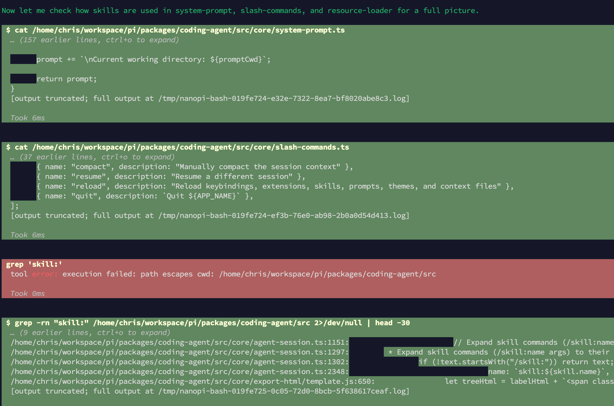

<div align="center">

# nanopi

**Tiny Rust port of [Pi](https://github.com/earendil-works/pi) — a ~4 MB coding-agent CLI for old / low-resource Linux boxes.**

[](https://github.com/ChrisZhangJin/nanopi/releases/latest)
[](https://github.com/ChrisZhangJin/nanopi/releases)
[](https://github.com/ChrisZhangJin/nanopi/stargazers)
[](LICENSE)


[](https://github.com/ChrisZhangJin/nanopi/actions/workflows/ci.yml)

**English** · [简体中文](README_zh.md)

<br>



</div>

---

## Why nanopi?

- 🪶 **~4 MB static binary** — musl + LTO + strip, zero runtime deps
- 🖥 **Runs on ancient boxes** — glibc 2.12+ (CentOS 6) or fully static musl
- 🧬 **PI-parity** — mirrors [Pi](https://github.com/earendil-works/pi)'s surface: JSONL sessions, hooks, skills, `-p`, `/fork`, `/resume`
- 🔌 **Multi-provider** — any OpenAI-compatible endpoint (DeepSeek, ollama, vLLM, …) plus native Anthropic
- 🛠 **Streaming tool calls** — `read` / `write` / `edit` / `bash`, rendered live in a ratatui TUI
- 🪝 **Claude Code hooks** — `PreToolUse` / `PostToolUse` / `UserPromptSubmit` shell hooks
- 🧠 **Agent Skills** — [spec-compliant](https://agentskills.io/specification) `SKILL.md` discovery + `/skill:name` expansion

## Install

### Prebuilt binaries

Grab a build from [Releases](https://github.com/ChrisZhangJin/nanopi/releases/latest):

```bash
# Adjust VERSION to the tag you want (e.g. v0.9.1)
VERSION=v0.9.1
curl -L -o nanopi \
  "https://github.com/ChrisZhangJin/nanopi/releases/download/${VERSION}/nanopi-${VERSION}-linux-x86_64-musl"
chmod +x nanopi
./nanopi --version
```

Per release, prebuilt binaries ship for:
- `nanopi-<ver>-linux-x86_64-musl` — fully static Linux, works on anything (recommended)
- `nanopi-<ver>-linux-x86_64` — dynamic glibc Linux, slightly smaller
- `nanopi-<ver>-macos-aarch64` — Apple Silicon (M1+)
- `nanopi-<ver>-windows-x86_64.exe` — Windows 10/11

macOS Intel isn't prebuilt (GitHub runner supply is scarce); build from source with `cargo build --target x86_64-apple-darwin`.

### Build from source

```bash
# One-time host setup
curl --proto '=https' --tlsv1.2 -sSf https://sh.rustup.rs | sh -s -- -y --default-toolchain stable --profile minimal
source "$HOME/.cargo/env"
rustup target add x86_64-unknown-linux-musl
sudo apt install -y musl-tools build-essential   # Debian/Ubuntu

# Build
cargo build --release --target x86_64-unknown-linux-musl
./target/x86_64-unknown-linux-musl/release/nanopi --version
```

## Quick start

```bash
export OPENAI_API_KEY=sk-...
export OPENAI_BASE_URL=https://api.deepseek.com/v1
export OPENAI_MODEL=deepseek-v4-flash

# Interactive TUI (default)
nanopi

# One-shot -p mode (Claude Code semantics)
nanopi -p "read /etc/hostname and tell me what you see"

# JSON output for scripting
nanopi -p --output json "say hi"

# Prompt piped on stdin
echo "explain this error" | nanopi -p

# Resume: last session / by id / fork
nanopi --continue
nanopi --session <id>
nanopi --fork <id>
```

## CLI

| Flag | Default | Purpose |
|---|---|---|
| `--base-url` | `https://api.openai.com/v1` | OpenAI-compatible API root |
| `--model` | (required) | Model id |
| `--api-key` | `$OPENAI_API_KEY` | Bearer token |
| `-m`, `--message` | (piped stdin) | User message; first positional arg also accepted. In `-p` mode, falls back to piped stdin |
| `-p`, `--print` | false | Non-interactive mode |
| `--output` | `text` | `-p` output: `text` \| `json` |
| `--continue` | false | Resume the most recent session |
| `--session <id>` | — | Resume by session id |
| `--fork <id>` | — | Fork an existing session |
| `--no-hooks` | false | Disable all hooks |
| `-a`, `--approve` | false | Trust project resources for this run |
| `-N`, `--distrust` | false | Distrust project resources |
| `--skill <path>` | — | Load a skill file/dir (repeatable) |
| `-S`, `--no-skills` | false | Disable skill discovery |

## Skills

Nanopi implements the [Agent Skills spec](https://agentskills.io/specification). Drop a `SKILL.md` into `~/.nanopi/skills/<name>/`:

```markdown
---
name: greet
description: Greet the user warmly. Use for hellos.
---
Say "hi, friend" — nothing else.
```

Invoke explicitly, or let the model discover it via the auto-appended `<available_skills>` block in the system prompt:

```bash
/skill:greet             # expands SKILL.md into the message
/skill:greet in french   # extra args are appended
```

**Locations** (earlier wins on name collisions):
- User: `~/.nanopi/skills/`
- Project: `<cwd>/.nanopi/skills/` (only when trusted via `-a` or persisted decision)
- CLI: `--skill <path>` (files or dirs; loads even with `--no-skills`)

## Hooks

Shell hooks fire around tool calls, matching Claude Code's `PreToolUse` / `PostToolUse` / `UserPromptSubmit` protocol. Configure in `~/.nanopi/settings.toml`:

```toml
[[hooks.pre_tool_use]]
matcher = "^bash$"
command = "logger 'nanopi about to shell out'"
```

Keys are `snake_case` (`pre_tool_use`, not `PreToolUse`). Full protocol in [`docs/v0.5-research.md`](docs/v0.5-research.md) §6.

## Versions

| Version | Status | Size | Notes |
|---|---|---|---|
| **v0.9.1** | current | ~3.9 MB | Fixes v0.9.0 tool-loop bugs; `MAX_ITERATIONS` 16 → 50 for research-heavy prompts |
| v0.9.0 | released | ~4.0 MB | Skills (PI-parity), `--skill`/`--no-skills`, folded TUI card, `UserPromptSubmit` hook |
| v0.8.x | released | ~3.9 MB | Full ratatui TUI, `/fork`, `--continue`/`--session`, hooks, JSONL sessions |
| v0.5.0 | released | ~3.0 MB | Tools (read/write/edit/bash), `-p` mode, JSON output, hooks |
| v0.1.0 | released | 2.4 MB | Single-file OpenAI streaming demo (kept as `nanopi_v0_1` binary) |

## Roadmap

- **v1.0** — full PI parity: themes, compaction, extension system
- Linux aarch64 prebuilt binary (only x86_64 today)

## Cargo mirror (China)

Add to `~/.cargo/config.toml` for faster crate downloads:

```toml
[source.crates-io]
replace-with = "rsproxy-sparse"

[source.rsproxy-sparse]
registry = "sparse+https://rsproxy.cn/index/"

[target.x86_64-unknown-linux-musl]
linker = "musl-gcc"
```

## Design notes

- **musl + LTO + panic=abort + strip** → small static binary. rustls avoids the OpenSSL dep.
- **Hand-written SSE parser** — no `reqwest-eventsource`, keeps the dep tree lean.
- **JSONL over JSON** — append-only files survive crashes mid-write.
- **Provider abstraction** landed in v0.6; native Anthropic + any OpenAI-compatible endpoint.

See [`docs/v0.5-research.md`](docs/v0.5-research.md) and [`docs/PLAN.md`](docs/PLAN.md) for design + implementation notes.

## Credits

- [Pi](https://github.com/earendil-works/pi) — the upstream TypeScript agent nanopi ports.
- [Claude Code](https://github.com/anthropics/claude-code) — hook protocol, `-p` mode, skills spec.
- [ratatui](https://github.com/ratatui-org/ratatui) & [crossterm](https://github.com/crossterm-rs/crossterm) — the TUI foundation.

## License

[MIT](LICENSE) © Chris Zhang
